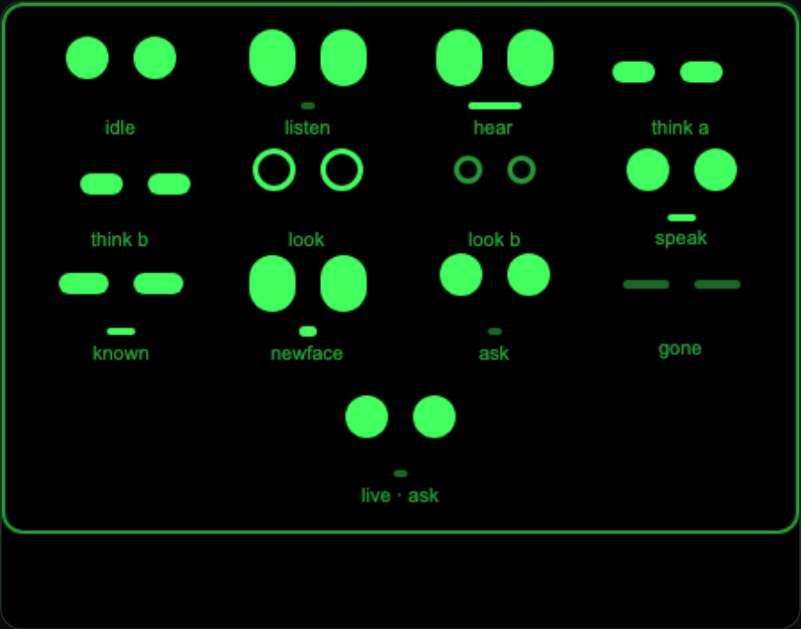
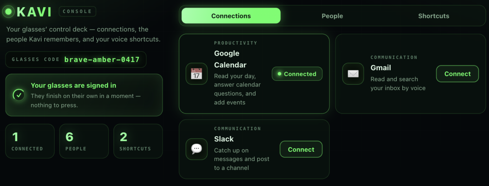
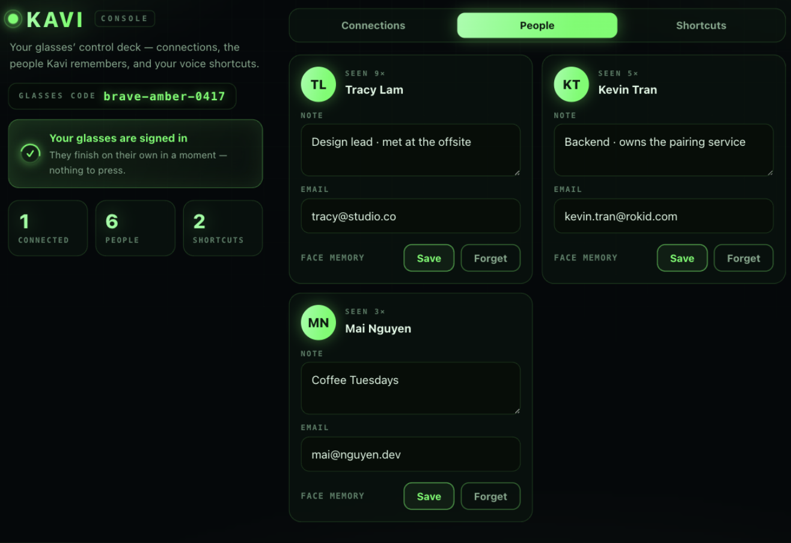

# 🕶️ Kavi

**A voice agent for [Rokid Glasses](https://global.rokid.com/) — connect your apps, and remember the people you meet.**

Say **“Kavi”**, ask in plain language, and Kavi plans a tool call, paints a heads‑up card, and speaks a one‑breath answer. No phone in your hand, no password on the glasses.

<p align="center">
  
  <br><em>The agent face — a few glowing dots that show what Kavi is doing.</em>
</p>

---

## ✨ What it does

- 🔌 **Connections, not features.** Every app is a *connection* brokered by [Composio](https://composio.dev) — authorized once on your phone, never stored on the glasses. **Google Calendar** is wired end‑to‑end; **Gmail** and **Slack** ride the same rails. Speak `Kavi <app> <action>`, or set your own shortcut (say *“mail”* instead of *“gmail”*).
- 🧠 **Memory beyond text.** Kavi remembers people by **face**. Look at someone and say *“Kavi halo”* to remember them; ask *“who is this?”* and it answers with their name, your notes, and any meeting you share today.
- 📅 **A real calendar assistant.** *“What’s on today?”* · *“Am I free tomorrow?”* · *“When does my flight start?”* · *“What does Kevin have today?”* — answered against your live calendar.
- 📱 **One place to manage it all** — a phone console for your connections, the people Kavi remembers, and your voice shortcuts.
- 🔐 **Passwordless sign‑in.** A short code on the HUD, opened on your phone; the glasses finish on their own. No app to install, nothing secret on the device.

---

## 🧠 Remembering people

Text isn’t the only thing Kavi keeps — it remembers **faces**. Meet someone, glance at them, and say **“Kavi halo”**: Kavi takes one photo, distils the face into a compact **faceprint**, and files it under *your* account with whatever note you add (*“design lead”*, *“met at the offsite”*). The next time they’re in front of you, ask **“who is this?”** and Kavi matches the live face against everyone you’ve met and answers with their **name, your notes, and any meeting you two share today**.

It’s private by design. Recognition never runs on the glasses — the photo goes to a Supabase Edge Function and comes back as an *answer*, so no camera model or face data ever lives on the device. Only the people **you** chose to remember are stored, each kept as a **vector, never a raw photo**, and scoped to your account; a stranger’s face is never saved. Rename, re‑note, or **forget** anyone from the phone console.

```text
  1 ·  you glance at someone and speak
     │      “Kavi halo”      →  remember them
     │      “who is this?”   →  recall them
     ▼
  2 ·  the glasses send one photo up to the cloud
     │
     ▼
  3 ·  a Supabase function turns that face into a match
     │      YuNet      ·  find the face
     │      SFace      ·  distil it to a 128‑number faceprint
     │      pgvector   ·  the nearest person you already know
     ▼
  4 ·  Kavi answers — on the HUD and out loud
            known  →  “That’s Tracy — you two share standup at 10.”
            new    →  “I don’t know them yet — say ‘Kavi halo’.”
```

---

## 📱 The console

Open the link your glasses show (or type the code) to run everything from your phone — a monochrome heads‑up dashboard in the glasses’ own green.

<p align="center">
  
  <br><em>Connect apps and see what’s live at a glance.</em>
</p>

<p align="center">
  
  <br><em>Rename, annotate, or forget the people Kavi remembers.</em>
</p>

Set a **passcode** and the console stays signed in on your phone (the session token is encrypted in your browser), so you can reopen without a fresh glasses code.

---

## 🗣️ How it works

```
 “Kavi …”  →  wake + speech  →  plan a tool call  →  Composio  →  your apps
                                       │
    speak  ←  heads‑up card  ←  shaped result  ←──────┘
```

The glasses are a **thin client** — capture, consent, render, speak. Everything heavy runs in the cloud, so no model or secret ever ships to the device:

- 🧩 **Supabase Edge Functions** — face recognition (YuNet detect → SFace embedding → pgvector search), device sign‑in, and the Composio proxy.
- 🔑 **Composio** — brokers every OAuth grant, server‑side, keyed to you.

---

## 🚀 Quick start

```bash
cp config.example.js config.js     # add your Supabase + Composio keys (config.js is gitignored)

npm run dev                        # http://localhost:5178/dev/runtime.html — the REAL Ink runtime
npm run pack                       # → dist/people-memory-*.aix   (upload in Craft)

npm run db:push                    # apply the Supabase migrations
npm run deploy                     # deploy the Edge Functions
```

`dev/runtime.html` loads Rokid’s own Ink Web SDK and paints your real `.ink` pages at 448 × 352 — the same engine the device runs — so the UI is genuinely exercised before it ever reaches the glasses.

---

## 🧱 Built with

Rokid **AIUI** `.aix` (Ink / QuickJS) · **Supabase** (Postgres + pgvector, Edge Functions on Deno) · **Composio** · a dependency‑free phone console on GitHub Pages.

---

## 📚 Docs

Deep dives live in [`docs/`](docs/):
[connections architecture](docs/14-connections-architecture.md) ·
[sign‑in flow](docs/11-aiui-on-glasses-login-flow.md) ·
[the agent face](docs/18-agent-face.md) ·
[running on glasses](docs/10-aiui-on-glasses-flow.md) ·
[roadmap](docs/19-roadmap.md).

---

## 🔒 Security at a glance

Faces, device tokens, and sign‑in codes are stored **hashed**; every table sits behind row‑level security with the service‑role key held only inside the functions. The publishable key that ships in the `.aix` can read or write nothing on its own. And sign‑in never puts a password on the glasses.
