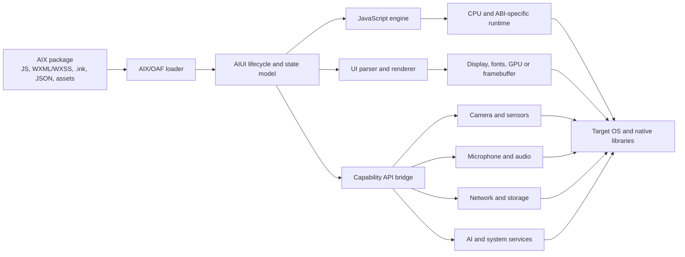
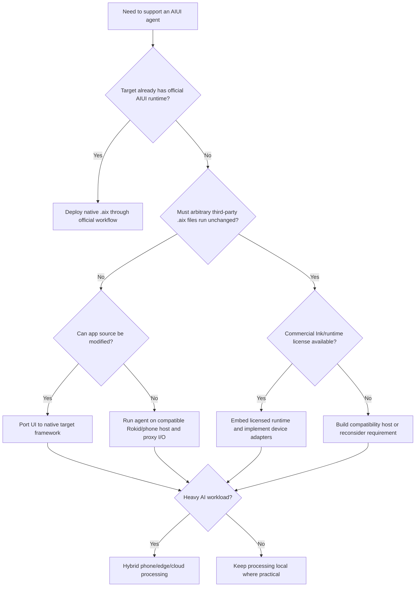

# Compatibility and architecture analysis

*Derived from `main.md` — "Compatibility and architecture analysis".*

## The portability boundary

The `.aix` package lies **above** the portability boundary. The native runtime, renderer, drivers, codecs, permissions, and OS services lie below it. Rokid's runtime uses QuickJS and Skia; its Android SDKs depend on platform-specific native audio libraries and device services.

## Compatibility dimensions

| Dimension | What must match or be adapted | Failure symptoms | Mitigation |
|---|---|---|---|
| Package semantics | OAF layout, `app.json`, `AGENTS.md`, routes, page precedence, `VERSION` | Package rejected, wrong entry page, missing capabilities | Validate with official `aix list`; create a schema/conformance test suite |
| JavaScript semantics | Modules, promises, timers, typed arrays, errors, memory limits, host globals | Script exceptions, hangs, subtle behavioral differences | Use a compatible JS engine; implement only documented globals; test error behavior |
| UI semantics | WXML, WXSS subset, `.ink`, units, fonts, layout, clipping, canvas | Misaligned UI, missing components, incorrect touch targets | Build a renderer compatibility matrix; use golden-image tests |
| CPU and ABI | ARM64 versus ARMv7; native library ABI; alignment and C++ runtime | `UnsatisfiedLinkError`, loader failure, native crash | Prefer `arm64-v8a`; inspect device ABI; rebuild all native dependencies |
| OS/API level | Android API, Linux libc, RTOS APIs, process model | Missing symbols, permission errors, service binding failure | Define minimum OS; use compatibility shims; avoid private APIs |
| Permissions | Camera, microphone, Bluetooth, Wi-Fi, storage, location/nearby devices | Security exception, silent sensor failure, pairing failure | Declare minimal permissions and request them at runtime |
| Camera and sensors | Formats, orientation, frame rate, calibration, timestamps | Rotated frames, high latency, incorrect motion data | Normalize metadata; timestamp at capture; calibrate per device |
| Audio input | Sample rate, channel count, PCM format, echo cancellation, capture ownership | Distorted ASR, underruns, unavailable microphone | Negotiate format; resample; serialize microphone ownership |
| Audio output | Codec support, stream type, routing, volume, interruptions | No sound, delayed TTS, conflicts with system audio | Use platform audio focus; predecode short sounds; provide visual fallback |
| Networking | Direct internet versus phone relay, TLS, proxy, reconnection | Timeouts, authentication loops, broken streaming | Abstract transport; implement retries, backoff, session resumption |
| Storage | Sandbox, package cache, quotas, writable paths | Update failure, lost state, excessive flash wear | Separate immutable package cache from user state; enforce quotas |
| Resource limits | RAM, flash, thermals, battery, GPU, JS heap | Killed process, thermal throttling, frame drops | Bound caches and JS heap; reduce assets; offload heavy inference |
| Lifecycle | Foreground/background, sleep, display-off, reconnect | Lost sessions, duplicate requests, stale UI | Persist state machine; make operations idempotent |
| Security boundary | Untrusted JS, network access, package signature, native bridge | Data exfiltration or code execution | Sandbox packages; permission-gate every native API; verify signatures |

### Notes on the hardest dimensions

- **CPU and ABI.** Official AIX contents are scripts and resources, so agent JavaScript generally needs no recompilation across ARM64/ARMv7 — but every runtime component and native extension must be rebuilt for the target ABI. On Android, `arm64-v8a` should be the primary target; add `armeabi-v7a` only when hardware requires it.
- **OS and libraries.** QuickJS alone is insufficient: a host also needs rendering, image decoding, fonts, networking, timers, storage, event dispatch, media, and native bindings. A WebView substitute reproduces some browser APIs but not AIUI's WXML/WXSS components, `.ink` parsing, lifecycle model, Rokid modules, or low-power behavior — acceptable for a controlled internal app, but not "general AIX compatibility" without conformance testing.
- **Permissions.** Android requires dangerous permissions at runtime; Android 12 introduced modern nearby-device permission behavior. Camera, microphone, and location are treated as particularly sensitive. Only request permissions reachable through the agent's approved capability policy; mark optional hardware `required="false"` to avoid store device-filtering surprises.
- **Sensors.** An AIUI API name does not guarantee equivalent behavior on another device (encoding, color space, orientation, latency, IMU axes/units/rate/timestamps). Normalize each device into a documented internal contract; never expose raw vendor values directly.
- **Audio.** Often the hardest integration area — the microphone may be owned by a wake-word service, system assistant, telephony stack, or DSP. The legacy Rokid OpenVoice 16 kHz/16-bit/mono PCM profile is a useful interoperability starting point, not a guaranteed current requirement.
- **Networking.** A direct-network assumption is unsafe: Glass3 documents the phone forwarding the glasses' internet traffic after P2P establishment. Depend on a transport abstraction, and handle timeouts, retries, error messaging, cached content, reconnection, and resume-from-background.
- **Resource constraints.** Ink is optimized for extreme wearable budgets. AIUI's own guidance: batch `setData`, transfer only needed view data, reuse list nodes, minimize package size, split packages, prefetch core data.

## Architecture comparison

| Approach | Preserves existing `.aix` | Engineering effort | Runtime latency | Portability | Main risk | Recommended use |
|---|---:|---:|---:|---:|---|---|
| Official Rokid AIUI runtime | Yes | Low | Best | Rokid-specific | Model/region/runtime availability | Rokid Glasses with supported AIUI |
| Source-level native rewrite | No; reuses source and behavior | Medium | Best | Medium | UI/API divergence | One or a small number of agents |
| Compatible AIX host | Potentially | Very high | Good if optimized | High after completion | Semantics, testing, Ink licensing | Product platform supporting many agents |
| Companion-phone middleware | Partially; logic can be preserved | Medium | Good over stable P2P | High | Connection lifecycle and degraded mode | Default for unknown/lightweight glasses |
| Cloud execution | Agent service can be centralized | Medium | Network-dependent | Very high | Privacy, availability, variable latency | Heavy AI and shared business logic |
| Linux container | Packages services, not full compatibility | Medium | Good locally | Medium among compatible Linux devices | Device/GPU/audio mapping | Capable Linux glasses or compute puck |
| RTOS native port | Usually no | Very high for full runtime | Excellent for small functions | Low | Memory/graphics/runtime limitations | Only minimal client logic |
| RTOS plus phone/cloud proxy | No local AIX runtime | Low to medium | Link-dependent | High | Offline limitations | Most RTOS glasses |

## Decision flowchart

