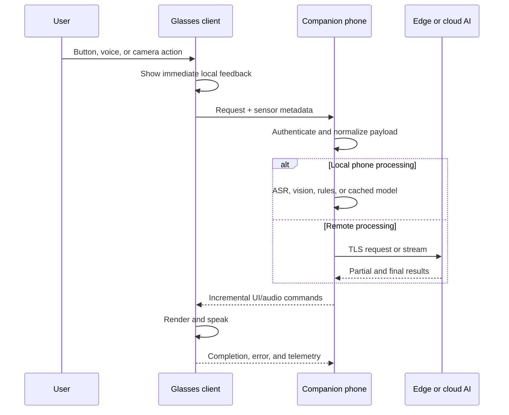

# Integration and packaging playbooks

*Derived from `main.md` — "Integration and packaging playbooks".*

## Native source-level port

The best engineering choice when the source of one or several agents is available and exact binary compatibility is unnecessary.

| Stage | Tasks |
|---|---|
| Inventory | Run `aix list`; record pages, assets, imports, API calls, event bindings, network endpoints, media formats, storage keys, and agent capabilities |
| Define target UI | Map AIUI views, text, images, lists, canvas, and input components to Android Views/Compose, Qt, Flutter, LVGL, or the vendor framework |
| Preserve business layer | Extract pure JavaScript functions, schemas, prompt templates, and request contracts into platform-independent modules |
| Build capability adapters | Implement camera, microphone, buttons, IMU, storage, network, TTS, ASR, and AI interfaces |
| Reproduce lifecycle | Map AIUI app/page launch, foreground, background, hide, unload, and error handling to target lifecycle callbacks |
| Migrate state | Replace `setData` with target reactive state; batch updates to avoid excessive rendering |
| Validate interaction | Compare original and ported state transitions, error cases, and output rather than only screenshot appearance |
| Package and sign | Produce APK, Linux package, or firmware image using the target vendor's normal process |
| Operationalize | Add logs, metrics, crash capture, versioning, rollback, and compatibility telemetry |

A useful application-level interface — the original AIUI code, a rewritten Android app, and a phone-proxy implementation can all target it, making the system testable with simulated devices:

```typescript
export interface GlassCapabilities {
  takePhoto(options?: {
    width?: number;
    height?: number;
    quality?: number;
  }): Promise<{
    mimeType: string;
    bytes: Uint8Array;
    capturedAtMs: number;
    orientationDegrees: number;
  }>;

  startAudio(options: {
    sampleRateHz: number;
    channels: 1 | 2;
    encoding: "pcm_s16le" | "opus";
  }): AsyncIterable<Uint8Array>;

  stopAudio(): Promise<void>;

  speak(text: string): Promise<void>;

  getImuSnapshot(): Promise<{
    timestampNs: bigint;
    accelerationMps2: [number, number, number];
    angularVelocityRadS: [number, number, number];
  }>;

  request<TRequest, TResponse>(
    operation: string,
    payload: TRequest
  ): Promise<TResponse>;
}
```

## Compatible AIX host runtime

Justified only when running multiple existing packages unchanged has strategic value.

1. Define a supported AIX profile: package version, OAF fields, UI components, CSS subset, JavaScript features, native APIs, and media types.
2. Implement a read-only package loader with path traversal protection, file-size limits, integrity verification, and strict manifest validation.
3. Embed a JavaScript engine and expose only allow-listed host functions.
4. Implement `app.json`, page routing, `.ink` parsing, app/page lifecycle, reactive data updates, event binding, and exception propagation.
5. Implement the UI component set in priority order: `view`, `text`, `image`, list, input, canvas, overlays.
6. Create native bridges for network, storage, camera, microphone, audio, buttons, IMU, AI, and application exit.
7. Add per-agent permission declarations and runtime consent.
8. Add watchdogs for JavaScript execution time, memory, network quotas, storage quotas, media resources, and background activity.
9. Build a conformance suite from official samples and internally authored edge cases.
10. Add compatibility profiles so packages can declare or detect available APIs instead of failing unpredictably.

A safe loader conceptually performs:

```text
verify outer signature
    → reject oversized package
    → list entries without executing
    → normalize each path
    → reject absolute paths and ".."
    → validate VERSION, AGENTS.md, app.json
    → enforce file type and per-file limits
    → extract into private immutable cache
    → calculate content hash
    → launch in restricted runtime
```

Do not rely on file-extension checking or JSON obfuscation as a security boundary. **Treat every `.aix` as potentially malicious** if packages may originate outside the organization.

## Android APK host or rewrite

Inspect the device first:

```bash
adb shell getprop ro.build.version.release
adb shell getprop ro.build.version.sdk
adb shell getprop ro.product.cpu.abilist
adb shell getprop ro.hardware
adb shell wm size
adb shell dumpsys meminfo
```

Restrict native packaging to confirmed ABIs:

```kotlin
android {
    compileSdk = 35

    defaultConfig {
        minSdk = 31

        ndk {
            abiFilters += listOf("arm64-v8a")
        }

        externalNativeBuild {
            cmake {
                cppFlags += listOf(
                    "-std=c++20",
                    "-fexceptions",
                    "-frtti"
                )
                arguments += listOf(
                    "-DANDROID_STL=c++_shared"
                )
            }
        }
    }

    externalNativeBuild {
        cmake {
            path = file("src/main/cpp/CMakeLists.txt")
        }
    }
}
```

Use the NDK-supplied Android CMake toolchain (not generic CMake Android behavior):

```bash
cmake -S runtime -B build/android-arm64 \
  -DCMAKE_TOOLCHAIN_FILE="$ANDROID_NDK_HOME/build/cmake/android.toolchain.cmake" \
  -DANDROID_ABI=arm64-v8a \
  -DANDROID_PLATFORM=android-31 \
  -DANDROID_STL=c++_shared \
  -DCMAKE_BUILD_TYPE=Release

cmake --build build/android-arm64 --parallel
```

Build, install, and distribute:

```bash
./gradlew clean assembleRelease

adb install -r \
  app/build/outputs/apk/release/app-release.apk

adb shell am start \
  -n com.example.aiuihost/.MainActivity

# Store distribution
./gradlew bundleRelease
```

The `.aab` is a publishing package; local device installation requires generated APKs (produce and test with `bundletool`).

## Companion-phone middleware

The strongest default for unknown glasses: it isolates vendor-specific device transport from application and AI services.



| Stage | Tasks |
|---|---|
| Define protocol | Versioned envelopes, request IDs, timestamps, cancellation, capabilities, errors, acknowledgments, and streaming chunks |
| Establish transport | Vendor SDK, Bluetooth for control, Wi-Fi Direct/P2P for media, or WebSocket over an available IP link |
| Build glasses shell | Render cards, progress, errors, and results; capture buttons, camera, microphone, and sensors |
| Build phone adapter | Authenticate, forward network requests, manage sessions, transcode media, and cache assets |
| Relocate agent logic | Run reusable JavaScript on the phone, rewrite it in Kotlin/Swift, or expose it as a service |
| Support disconnection | Queue or reject operations deterministically; cancel stale requests; reconnect with session resumption |
| Add degraded mode | Local commands, cached content, offline status, and explicit cloud-unavailable behavior |
| Secure pairing | Bind phone and glasses, rotate session keys, prevent unauthorized nearby clients |
| Measure | Stamp events on both devices and correlate request IDs to calculate end-to-end latency |

A compact protocol envelope:

```json
{
  "protocol": "aiui-bridge/1",
  "messageId": "018f73c8-86b8-7aa0-a680-76e7d1f50c31",
  "sessionId": "sess-9a12",
  "timestampMs": 1785753600123,
  "kind": "request",
  "operation": "vision.describe",
  "capabilities": ["camera.jpeg", "display.card.v1"],
  "payload": {
    "imageRef": "blob:frame-4421",
    "locale": "en-US"
  }
}
```

For large camera or audio payloads, send metadata separately from binary frames. Do not base64-encode continuous media unless the transport requires it — base64 increases size and allocation pressure.

## Cloud or edge processing

Suitable for language models, large speech recognition models, complex vision, search, synchronization, and centralized business policy. Hybrid designs perform time-critical tracking and feedback locally while offloading expensive recognition or inference.

1. Keep capture control, consent, view rendering, cancellation, and immediate feedback on the glasses.
2. Put authentication, request policy, compression, connectivity management, and local caching on the phone or edge gateway.
3. Selectively offload only operations whose compute savings justify network latency and privacy exposure.
4. Use streaming results so the user receives progress or partial text before the complete answer.
5. Cache models, prompts, reference data, and recent results where policy permits.
6. Define timeouts and fallbacks per operation rather than one global timeout.
7. Redact or crop sensor data before upload where possible.
8. Record inference region, model version, consent state, and retention policy in auditable metadata.
9. Provide a local or phone-side fallback for essential functions.
10. Test under packet loss, variable bandwidth, captive portals, phone sleep, and server overload.

## Linux cross-compilation and containerization

```bash
cmake -S runtime -B build/linux-aarch64 \
  -DCMAKE_SYSTEM_NAME=Linux \
  -DCMAKE_SYSTEM_PROCESSOR=aarch64 \
  -DCMAKE_C_COMPILER=aarch64-linux-gnu-gcc \
  -DCMAKE_CXX_COMPILER=aarch64-linux-gnu-g++ \
  -DCMAKE_BUILD_TYPE=Release

cmake --build build/linux-aarch64 --parallel

aarch64-linux-gnu-strip \
  build/linux-aarch64/bin/aiui-host
```

Check dynamic dependencies before deployment:

```bash
aarch64-linux-gnu-readelf -h build/linux-aarch64/bin/aiui-host
aarch64-linux-gnu-readelf -d build/linux-aarch64/bin/aiui-host
file build/linux-aarch64/bin/aiui-host
```

A service-oriented container separates the headless AI/backend process from the host display and sensor adapter:

```dockerfile
FROM --platform=$BUILDPLATFORM debian:stable-slim AS build

ARG TARGETARCH
RUN apt-get update && \
    apt-get install -y --no-install-recommends \
      cmake ninja-build g++ gcc && \
    rm -rf /var/lib/apt/lists/*

WORKDIR /src
COPY . .
RUN cmake -S . -B build -G Ninja \
      -DCMAKE_BUILD_TYPE=Release && \
    cmake --build build

FROM debian:stable-slim
RUN useradd --system --uid 10001 aiui
COPY --from=build /src/build/bin/agent-service \
  /usr/local/bin/agent-service
USER 10001
ENTRYPOINT ["/usr/local/bin/agent-service"]
```

```bash
docker buildx build \
  --platform linux/arm64 \
  -t registry.example.com/agent-service:1.0.0 \
  --push .
```

Use containerization for inference, caching, business logic, and protocol translation. Keep display composition, camera ownership, audio routing, and vendor SDK calls in a small host-native daemon unless the platform explicitly supports passing those devices safely into containers.

## RTOS integration

The glasses component should be a compact native client:

```bash
west build -b <vendor_board> \
  -d build/<vendor_board> \
  app

west sign -t imgtool \
  -d build/<vendor_board> \
  -- \
  --key keys/update.pem

west flash \
  -d build/<vendor_board>
```

The RTOS client should implement only:

```text
button and wake events
camera/audio capture supported by hardware
small display card renderer
Bluetooth or Wi-Fi transport
versioned message protocol
local timeout/cancel behavior
secure firmware update
watchdog and crash counters
```

The AIUI agent logic should run on a phone, edge gateway, or cloud service. Porting a complete Ink-like renderer, JavaScript runtime, image stack, network stack, and agent sandbox to a constrained MCU is a separate product-platform program, not a packaging exercise.
