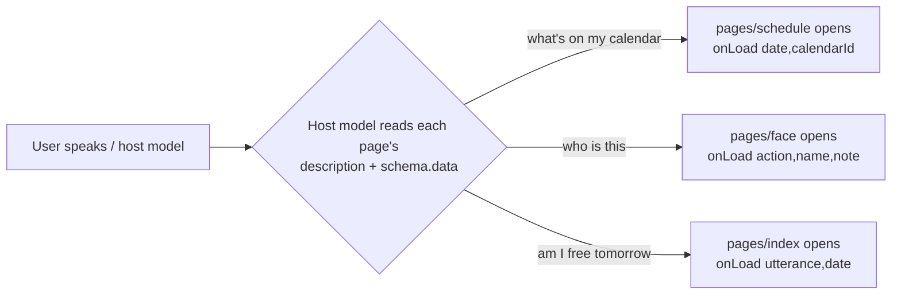
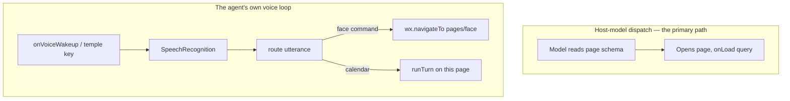
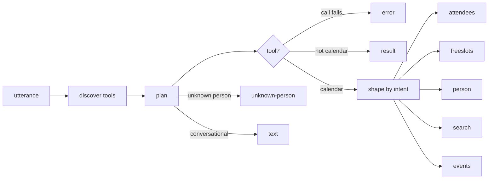
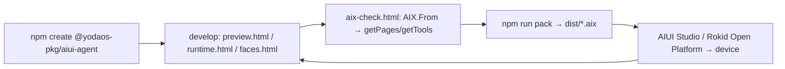

# How to build an AIUI agent — the flow, with this repo as the worked example

*A build guide for Rokid AIUI `.aix` agents, grounded in **People Memory**. Every claim is anchored to a file in this repo or to the bundled framework reference under `.agents/skills/aiui-dev/`. Where the framework docs and the runtime disagree, the runtime wins and it's flagged.*

---

## 0. The one idea everything else follows from

**An AIUI agent has no home screen. It is a set of pages, and each page is a tool the host model can call.**

A page declares, in its `<script def>` block, a natural-language `description` and a JSON-Schema `schema.data`. The host model on the glasses reads those, decides which page answers the user's request, and opens it with structured arguments delivered to `onLoad(query)`. You can see this is literal, not a metaphor: `dev/aix-check.html:55-56` reads a built `.aix` with Rokid's own `AIX.From()` and calls `aix.getPages()` and **`aix.getTools()`** — the tools *are* the pages, derived from their schemas.

So "building an agent" is really: **author pages that each declare what they answer, and put the logic behind them.** `app.json`'s `pages` array just lists the routes; its first entry is only a *default landing page* for a bare launch (`.agents/skills/aiui-dev/SKILL.md:69`), not the app's resting state.



This is why the project's own README insists "Nothing renders until you ask for something," and why the dev harness boots to *"No page dispatched"* (`dev/runtime.html:274-277`).

---

## 1. Project anatomy

A standard AIUI project (`SKILL.md:16-24`), mapped to this repo:

| File / dir | Role | Here |
|---|---|---|
| `AGENTS.md` | Agent manifest — identity + capabilities/permissions (Open Agent Format) | `AGENTS.md` — name, version, description, `camera/microphone/network/audio/storage` |
| `app.json` | Global config: `pages` routing registry (required), `window`, optional `fonts` | `app.json` — 3 pages, black nav bar |
| `app.js` | App lifecycle + `globalData`, ES-module default export | `app.js` — `onLaunch` logs the build number, `globalData.lastTurn` |
| `pages/**/*.ink` | Pages as single-file components (preferred over multi-file) | `pages/index`, `pages/schedule`, `pages/face` |
| `config.js` | (Not framework-mandated) app configuration | Composio transport, wake word, Supabase, timezone, build |
| `utils/*.js` | (Not framework-mandated) plain JS the pages import | the turn engine, planners, calendar math, face client |
| `assets/` | Static resources; bundled fonts go under `assets/fonts/` | *(none — this agent ships no images/audio)* |

Two framework facts worth internalizing early:

- **Every new page must be registered in `app.json`'s `pages`** or the framework never loads it (`SKILL.md:70`). `dev/pack.mjs:45-49` enforces this at package time — it throws if `app.json` lists a page whose `.ink` file is missing.
- `AGENTS.md` is parsed strictly as the manifest. (This project's memory notes a real failure where a malformed `AGENTS.md` broke the upload with a misleading "512-char description" error.)

---

## 2. The `.ink` single-file component

One page = one `.ink` file with four blocks (`SKILL.md:243-252`). From `pages/schedule/schedule.ink`:

```html
<script def>          <!-- 1. CONFIG: the tool contract the host dispatches on -->
{ "navigationBarTitleText": "Schedule",
  "description": "One-day agenda card from Google Calendar…",
  "schema": { "data": { "type": "object",
    "properties": { "date": {"type":"string","description":"yyyy-mm-dd…"},
                    "calendarId": {"type":"string","description":"…"} },
    "required": [] } } }
</script>

<script setup>        <!-- 2. LOGIC: export default { data, lifecycle, methods } -->
import { ComposioClient } from '../../utils/composio.js';
export default { data:{…}, async onLoad(query){…}, onShow(){…}, load(){…} };
</script>

<page> … </page>      <!-- 3. STRUCTURE: WXML-like template -->
<style> … </style>    <!-- 4. STYLE: WXSS -->
```

Writing the **`<script def>`** well is the highest-leverage thing you do, because it's the tool signature (`SKILL.md:96-107`):

- `description` — say what the page *displays or accomplishes*, from a UI perspective, specific and observable. Compare `pages/schedule/schedule.ink:4` ("One-day agenda card… start times, titles, locations") to a bare "Schedule page."
- `schema.data` — the complete render-input contract. Top-level `type:"object"`, all fields in `properties`, `required` for must-exist fields, and use `enum`/`description` to guide the model. `pages/face/face.ink:9-13` uses an `action` enum (`identify|remember|note|forget|list`) so one page answers five intents.

The template uses `{{ }}` binding, `ink:if/elif/else`, and `ink:for` with `ink:key` (`SKILL.md:308-342`). The component set is `view, text, image, button, canvas, scroll-view, chart, lottie-view, error-state`, plus `card` (`SKILL.md:352-360`, full reference `components.md`).

---

## 3. Lifecycle and the two ways an agent starts

### Callbacks

| Callback | Fires | Documented in bundled ref? |
|---|---|---|
| `onLaunch()` (app) | app boot | yes (`SKILL.md:78`) |
| `onLoad(query)` (page) | **the dispatch entry** — host opens the page with schema args | yes (`SKILL.md:270`) |
| `onShow()` / `onHide()` / `onUnload()` (page) | foreground / background / teardown | **no** — relied upon here, not in the bundled reference |
| `onVoiceWakeup(event)` | wake word; read `event.keyword` | yes (`SKILL.md:511-529`) |
| `onKeyDown` / `onKeyUp(event)` | hardware keys | yes (`SKILL.md:366-509`) |

> **Documented vs. relied-upon.** The bundled `aiui-dev` reference names only `onLoad`, the key handlers, and `onVoiceWakeup`. This project uses `onShow`/`onHide`/`onUnload` throughout (`pages/index/index.ink:149-177`) and they work on the real Ink runtime — but treat anything outside the documented set as "verify on device," and treat page navigation/exit (`this.finish()` in `pages/schedule/schedule.ink`, `wx.navigateTo` in `pages/index/index.ink:380`) the same way, since the reference documents `wx.navigateTo`/`navigateBack`/`exitMiniProgram` but not `finish`.

Two runtime truths that shape all page logic, both learned here the hard way (README "What the real runtime changed"):

- **`setData` is asynchronous.** A flag written with `setData` is not visible to code later in the same tick. Re-entrancy guards therefore live on the instance, never in `this.data` — see `this.busy` in `pages/index/index.ink:238` and the fix I made to `pages/schedule/schedule.ink:61`.
- **Key input on Rokid:** the temple touch reports as `event.code === 'GlobalHook'`; `Enter` mirrors it (`pages/index/index.ink:322-328`).

### The two entry points



The subtle design rule this repo follows: **both entry points must share one vocabulary.** Face phrasings are declared twice on purpose — once as `pages/face/face.ink`'s schema (so the host model can dispatch straight to it) and once as `faceCommand()` in `utils/planner.js:152-170` (so the agent's own voice loop routes the same words). The dev harness proves they can't drift by using the *same* `faceCommand()` to dispatch (`dev/runtime.html:425-440`).

---

## 4. The logic behind a page: one turn engine, injected dependencies

`pages/index/index.ink` delegates a spoken calendar turn to `utils/agent.js`. `runTurn({ utterance, composio, planner, context, onStage })` (`utils/agent.js:38`) is a fixed pipeline that returns one of **nine "kinds"**:



Two things make this testable and portable, and they're the pattern to copy:

- **Dependency injection.** The Composio client, the planner, and the storage backend are all passed in, so the *same* code runs on the glasses and in the browser harness (`utils/store.js:1-12` takes an injected `{get,set}` backend; `dev/preview.html` imports the real `utils/*.js`).
- **Two planners behind one interface** (`utils/planner.js`). `rulePlanner` (`:198-314`) is a keyword router that emits rich intents (`person`, `freeslots`, `attendees`, `unknown-person`); `llmPlanner` (`:369-429`) drives the on-device `LanguageModel` but only picks a tool + args, so the richer intents are rule-planner-only. The rule planner is a **feature, not a fallback** — it keeps the agent working where the model is absent, which is most hosts today (`config.js` ships `PLANNER.useLanguageModel: false`).

---

## 5. The capability surface (what a page may call)

Everything runs on `wx` + a few globals (`apis.md`; `import wx from 'wx'`). The verified, load-bearing subset for an agent like this:

| Need | API | Used at | Notes |
|---|---|---|---|
| Persist state | `wx.setStorageSync/getStorageSync` | `utils/store.js:15-32` | The verified storage API — **not** `localStorage`. May JSON-serialize on the way in, so a read can be string *or* object. |
| Camera | `wx.media.createCameraContext().takePhoto({quality})` → `{data:ArrayBuffer}` | `pages/face/face.ink:230` | **Requires an interactive call site** — throws otherwise. |
| Speak | `wx.speech.playTTS(text)`, else `speechSynthesis.speak(...)` | `pages/face/face.ink:578-586` | Only `speak` is exposed on the web-speech shim. |
| Listen | `new SpeechRecognition()` | `pages/index/index.ink:340` | Interactive-gated; throws `InvalidStateError` when non-interactive. |
| On-device LLM | `LanguageModel.availability()` / `.create()` / `session.prompt()` | `utils/planner.js:384-422` | `availability()` can **hang** on a capability-less host, so it's raced with a 2.5 s timeout. The text stream is poll-based `read()`, not an async iterator. |
| Reach a server | `fetch` | `utils/composio.js`, `utils/faceservice.js` | No `AbortController`; `setTimeout` isn't on every build — so deadlines are feature-detected races (`utils/faceservice.js:46-52`, and the one I added at `utils/composio.js`). |

Two portability patterns worth adopting wholesale: **feature-detect anything not guaranteed** (`setInterval`, `setTimeout`, `AbortController`), and **abstract the transport** (`utils/composio.js` puts REST and MCP behind one `ComposioClient` interface so page code never changes).

---

## 6. The runtime realities that shape the code

This is the part you can't guess from the API docs, and it's most of what "deeply understanding this code" means. The Ink runtime (QuickJS + Skia) diverges from a browser in specific ways, and large chunks of this repo exist *only* to work around them:

| Runtime reality | Consequence in this repo |
|---|---|
| **`Date` is half-broken** — `Date.now()`/`Date.parse(…+09:00)`/`.valueOf()` work, but `getFullYear()`→2060, `getTimezoneOffset()`→garbage, `toISOString()`→garbage, `Intl` undefined | **All of `utils/clock.js`** — epoch-ms + Howard-Hinnant civil-calendar integer math, no component getters or formatters anywhere. The UTC offset is passed in explicitly and *learned* from event timestamps (`utils/calendar.js:40-47`). |
| **Ink evaluates an expression only as a whole attribute value**, and warns on any template variable missing from the bound data | Conditional classes are precomputed in JS (`rowClass`), and every row declares all its fields up front (`utils/calendar.js:274-310`). A `Template variable … missing from data` warning is a **defect, not noise**. |
| **`<canvas>` renders nothing** on the web host (calls succeed, surface stays blank) | Thumbnails are PNGs the Edge Function encodes, drawn with `<image src="data:image/png;base64,…">` (`pages/face/face.ink:625`; encoder `supabase/functions/_shared/png.ts`). |
| **`<scroll-view>` needs a definite pixel height**; `flex:1`/`min-height` collapse to zero in some hosts | Lists are plain `<view>`s bounded by `capRows()` with a "+N more" line (`utils/calendar.js:185-197`). |
| **`box-sizing: border-box` is ignored** | Widths are content-box values (420px card, not 448) (`pages/*/*.ink` `.card`). |
| **`<block>` doesn't exist**; `text-overflow`/`white-space`/`word-break`/`animation` unsupported (`wxss.md:162-181`) | Grouping wrappers are explicit flex columns; text is clipped in JS by column width (`utils/calendar.js:143-175`). |
| **Single-green display** — one hue, four opacity steps, on black; no red (`design-system-green.md`) | `error-state` uses a faint green fill, never red; emphasis is outline + opacity, never shadow. |

The meta-lesson: **validate UI on a host that reproduces the target, not on the logic preview.** `dev/preview.html` reimplements the card in HTML and cannot catch any of the above; only `dev/runtime.html` (the real Ink WASM engine) can. (This is captured in the project's memory as a standing rule.)

---

## 7. Where the heavy work goes: off the glasses

The report in `docs/01`–`07` recommends a thin client plus cloud services, and this agent is a clean instance of it: **the `.aix` captures input and draws answers; the hard computation runs elsewhere.**

- **Calendar** → **Composio**, which holds the Google OAuth tokens server-side; the glasses only send a user id (`utils/composio.js`, `config.js`). No OAuth flow on the device.
- **Face recognition** → **Supabase Edge Functions**, because the Ink runtime has no image decoder and no face model. The pipeline (`supabase/functions/_shared/pipeline.ts:130-145`) is **decode → detect → align → embed**: JPEG decode with fused EXIF-orientation + downscale in one pass (`image.ts`), YuNet detection on a 640×640 BGR letterbox (`yunet.ts`), a closed-form similarity transform onto the 112×112 ArcFace template (`align.ts`), and an int8 SFace embedding, L2-normalized so pgvector cosine distance is a dot product (`sface.ts`). Thresholds `TENTATIVE 0.38` / `CONFIDENT 0.5` sit above OpenCV's published 0.363 same-person cutoff on purpose — a memory aid that says the wrong name with conviction is worse than one that admits doubt (`sface.ts:25-35`).

That backend has its *own* forcing functions worth seeing as the mirror image of the Ink constraints: ORT pinned to 1.16.3 (1.19+ ships only threaded WASM the runtime refuses), imported dynamically inside a `try` (a static import killed the worker at boot), from a CDN not npm (the npm package's 22 MB of `.wasm` exceeds the deploy limit), with models loaded from a private Storage bucket at cold start (`supabase/functions/_shared/ort.ts`, `pipeline.ts`). Same discipline, different runtime.

---

## 8. The build → run → validate → package → publish loop



**Scaffold** (`SKILL.md:97-108`): `npm create @yodaos-pkg/aiui-agent my-agent` generates `AGENTS.md`, `app.js`, `app.json`, `pages/index/index.ink`.

**Develop** against three local surfaces (`npm run dev`, `dev/server.mjs`):
- `dev/preview.html` — fast logic harness; imports the real `utils/*.js` but reimplements the card in HTML, so it validates planning/Composio/shaping but **nothing about `.ink` rendering**.
- `dev/runtime.html` — the **real Ink WASM runtime**: `createInkView({width:448,height:352,…})` → `view.openBundle({ appId, files, initialPage, query })` (`dev/runtime.html:249-340`). It exercises the actual template/WXSS/lifecycle, and can switch `layoutMode` between `bounded` (full-screen 448×352 and the 448×150 InkView surface) and `width-constrained-auto-height` (Craft's chat card) — you must verify at all of them, because heights resolve differently.
- `dev/faces.html` — the face bench, for exercising the recognition backend on your own webcam.

**Validate the package** with Rokid's own reader (`dev/aix-check.html`): `AIX.From(bytes)` → `aix.getTitle()/getVersion()/getPages()/getTools()`. If a page you wrote doesn't show up as a tool, its `<script def>` is malformed.

**Package** (`npm run pack`, `dev/pack.mjs`): the `.aix` is an ordinary ZIP of the agent's own files plus a generated `VERSION` marker. Only `app.js, app.json, AGENTS.md, config.js, utils, pages` ship (`dev/pack.mjs:27`); `dev/`, `node_modules/`, `.claude/` never do. The packer also fails if `app.json` lists a missing page.

**Publish**: upload the `.aix` through **AIUI Studio on the Rokid Open Platform** (the former Rizon path; region-dependent — see `docs/02`), then verify on physical glasses, because the wake word, TTS, `LanguageModel`, and the temple key can only be confirmed there.

> Note: the bundled `aiui-dev` reference covers authoring and the runtime API only — it does not mention the `aix` CLI, QuickJS, or Craft. Those come from Rokid's platform docs and this project's own tooling (`docs/02`, `README.md`).

---

## 9. Build-your-own recipe (the distilled flow)

1. **Name the jobs.** List the distinct things a user will ask for. Each becomes a **page** (a tool). Keep pages single-purpose; use a `schema.data` `enum` when one page genuinely covers several closely-related intents (as `pages/face` does).
2. **Scaffold** with `npm create @yodaos-pkg/aiui-agent`, fill in `AGENTS.md` (identity + only the permissions you use), and register every page in `app.json`.
3. **Write each page's `<script def>` first** — a specific, observable `description` and a complete `schema.data`. This is the contract the host dispatches on; the UI is downstream of it.
4. **Put logic in plain `utils/*.js`, injected into pages.** Keep it host-agnostic (no `wx` import in the logic) so it runs in the browser harness too. Abstract any transport; feature-detect anything not guaranteed.
5. **Handle both entry points** — host dispatch via `onLoad(query)`, and (if you want a voice loop) `onVoiceWakeup` + a router that shares one vocabulary with your page schemas.
6. **Respect the runtime**: instance flags for re-entrancy (not `this.data`), epoch-ms date math, precomputed classes, content-box widths, `<image>`+data-URI instead of canvas, `capRows` instead of `<scroll-view>`, single-green styling via `var(--token)`.
7. **Push heavy work off-device** — a phone/edge/cloud service for models, large data, and anything needing secrets; keep capture, consent, and rendering on the glasses.
8. **Loop through the harnesses**: logic in `preview`, real rendering in `runtime` at every layout mode, package with `pack`, read it back with `aix-check`.
9. **Ship secrets safely** — no long-lived keys in the `.aix`; put a proxy or token-exchange in front (see `docs/07` and `docs/08`).
10. **Publish through AIUI Studio and confirm on hardware** — the wake word, camera, TTS, and `LanguageModel` are only real once they've run on the glasses.

---

*Cross-references: framework contract in `.agents/skills/aiui-dev/` (`SKILL.md`, `components.md`, `wxss.md`, `apis*.md`, `design-system-green.md`); the portability rationale in `docs/01`–`07`; the security review in `docs/08`.*
