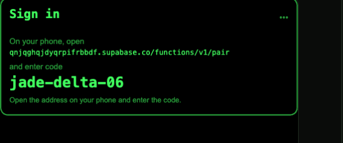
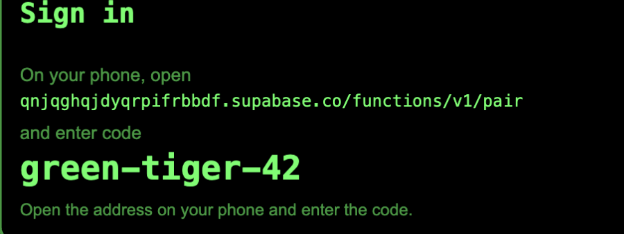
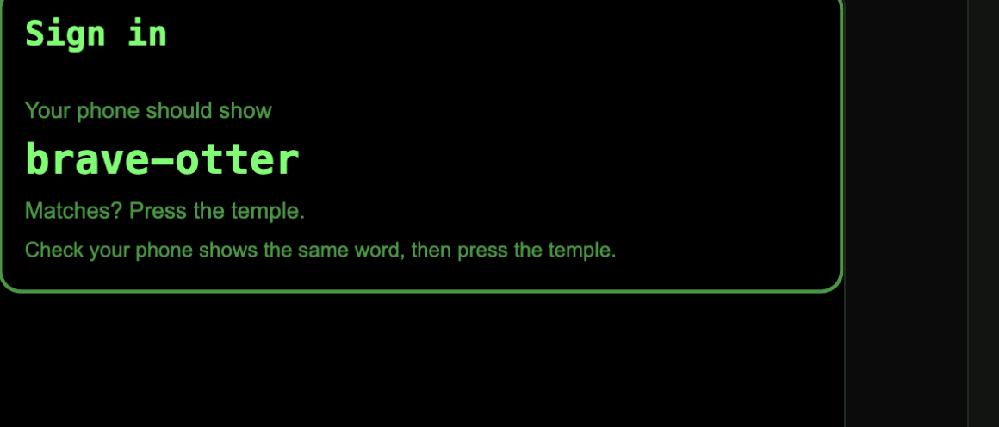
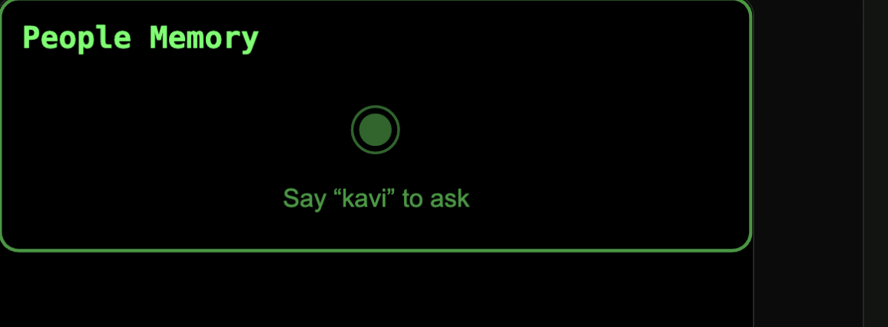

# How a wearer signs in on the glasses

*Companion to [doc 10](10-aiui-on-glasses-flow.md), same picture-first format. This is the **login** flow: how a person ties the glasses to their own account, with no phone app to install.*

> **Built AND deployed to the live project (`rokid Project`, ref `qnjqghqjdyqrpifrbbdf`).** The migration (`pairing_sessions`, `devices`) is applied and the `pair` function is deployed public. **There is no email, password, or login account** — connecting Google Calendar through Composio *is* the sign-in, and the pairing gets a device-scoped identity the moment the glasses start it. Verified against the real backend: `start` returns a code, `connections authorize` returns a real Composio OAuth URL **from just that code, no login**, `approve` refuses until Google is actually connected, and the phone page loads with no email step. It is **on for the store build** (`AUTH.required = true` in `config.js`); flip it off only for local dev. What still needs a human: tapping through the Google consent once on the phone.

## Live proof (real deployed backend)

The sign-in card in the real Ink runtime, showing a code — **`jade-delta-06`** — fetched from the **deployed** `pair` function (the runtime log read `net → POST https://qnjqghqjdyqrpifrbbdf.supabase.co/functions/v1/pair`). This is the actual UI against the actual backend, no mock:



## Real screens (from the Ink runtime)

Captured from `dev/runtime.html` — the **actual Ink WASM engine**, the same one Craft and the glasses use, rendering `pages/signin/signin.ink`. The runtime log read `launch — transport=rest wake=kavi`, confirming the live build. A dev mock stands in for the `pair` backend so the states render without a deploy; on real glasses the same page calls the deployed function.

**1. The glasses show the code** — the real Supabase URL (scheme dropped so it fits) and the pairing code:



**2. Approved** — the confirm word appears; the wearer checks it matches their phone and presses the temple:



**3. Signed in** — one press finishes it and hands back to the agenda, which shows the **Kavi** wake word:



## The whole thing in one picture

```
   first time the agent runs (no account yet)
                |
                v
   +---------------------------------+
   |  glasses show a short code       |
   |  and a web address               |
   +---------------------------------+
                |   wearer reads it, opens it on their phone browser
                v
   +---------------------------------+
   |  phone: sign in  +  allow        |
   |  calendar access                 |
   +---------------------------------+
                |   phone and glasses show the SAME word
                v
   +---------------------------------+
   |  wearer presses the temple       |
   |  to confirm they match           |
   +---------------------------------+
                |
                v
   +---------------------------------+
   |  glasses save a token            |
   |  -> signed in, just works        |
   +---------------------------------+
```

The phone is only a browser. Nothing to install.

## What the sign-in card looks like

```
  +-------------------------------------+
  |  Sign in                            |
  | ----------------------------------- |
  |  Tap the link on your phone:        |
  |   ...supabase.co/functions/v1/      |
  |     pair?go=green-tiger-42          |
  |  (word-code, so it is easy to say)  |
  +-------------------------------------+
        speaks: "Tap the link on your phone and connect your Google Calendar."
```

Tapping the link redirects straight to Google's consent screen — there is no page
to load and nothing to type. The word-code is shown too, as the human check: the
same word comes back at the end for the wearer to compare.

> **The address is the real Supabase function URL** —
> `qnjqghqjdyqrpifrbbdf.supabase.co/functions/v1/pair` for this project — which is
> exactly what the `pair` function returns to the glasses. It is long to type, so
> set `PAIR_VERIFY_URL` (or a Supabase custom domain) to show a short link
> instead. There is no built-in short domain.

## Simulation - signing in, step by step

```
  step 1 - the glasses show a code               (phone: nothing yet)
  GLASSES
  +---------------------------+
  |  Sign in                  |
  | ------------------------- |
  |  open the address on phone|
  |  code:  green-tiger-42    |
  +---------------------------+
```

```
  step 2 - wearer taps the link; it redirects straight to Google
  GLASSES                          PHONE  (Google's own consent, via Composio)
  +---------------------+          +-------------------------+
  |  Sign in            |          |  Google                 |
  |  Waiting...         |   <-->   |  Kavi wants to access   |
  |                     |          |  your Calendar          |
  |                     |          |  [ Allow ]              |
  +---------------------+          +-------------------------+
```

```
  step 3 - Google returns a one-line confirmation carrying the word
  GLASSES                          PHONE  (plain text back from Google)
  +---------------------+          +-------------------------+
  |  Confirm sign-in    |          |  Signed in! If your     |
  |  green-tiger        |   <-->   |  glasses show           |
  |  press to confirm   |          |  "green-tiger", press   |
  |                     |          |  the temple to finish.  |
  +---------------------+          +-------------------------+
       press the temple  (or say "green tiger")
```

```
  step 4 - done
  GLASSES
  +---------------------+
  |  Signed in          |
  |  You're all set     |
  +---------------------+
       ...and it goes straight to the calendar.
```

## Why the word on both screens

The matching word proves the person who just signed in on the phone is the same person wearing the glasses. Without it, someone could try to sign your glasses into their account, or the reverse. The wearer only has to check the two words are the same and press once.

```
   glasses:  green-tiger          phone:  green-tiger
                \                        /
                 \___ same? press ______/   ->  bound together
```

## What ends up stored where

```
  ON THE GLASSES after login
  +------------------------------------+
  |  a device token  (can be revoked)  |   <- NOT a password, NOT a Google login
  +------------------------------------+

  ON THE SERVER
  +------------------------------------+
  |  the real logins live here:        |
  |   - Composio holds the Google login|
  |   - the token maps to your account |
  +------------------------------------+
```

So no password and no Google login ever sits on the glasses. If the glasses are lost, the token is turned off from the web and they stop working.

## Why not just scan a QR off the glasses

```
   the glasses screen is only visible to the wearer's own eye
   (it is projected into the eye, not shown on the outside)

        a phone camera pointed at the glasses  ->  sees nothing

   so the wearer READS the short code and types it on their phone instead.
```

(The other direction works, as a faster option later: the phone shows a QR and the glasses camera scans it. That rides the camera, which has not run on real glasses yet.)

## What is built

```
  the login flow                         deployment status (rokid Project)
  ----------------------------           ----------------------------
  [x] sign-in page on the glasses        [x] migration applied to live DB
  [x] pair function + tables (Supabase)  [x] pair + connections deployed (public)
  [x] token stored + checked on launch   [x] verified live: start / authorize /
  [x] Google-connect IS the sign-in          approve-guard / phone page (no email)
  [x] gated on (AUTH.required = true)

  still needs a human / hardware:
  [ ] tap through Google consent once on the phone (Composio managed OAuth)
  [ ] run the temple-press confirm on physical glasses (browser runtime only so far)
```

## A few real-world notes

```
  no app     the phone only needs a browser. Nothing to install.

  one time   signing in happens once. After that it just works, and the
             server quietly keeps it alive - no signing in every day.

  revoke     a "my glasses" web page lists paired glasses and can turn
             any of them off (lost, sold, wrong account).

  privacy    the web page is where the wearer sees what they are allowing
             (calendar, faces) - the tiny green card is too small for that.
```

---

*The runtime side (what happens after sign-in, every day): [doc 10](10-aiui-on-glasses-flow.md).*
