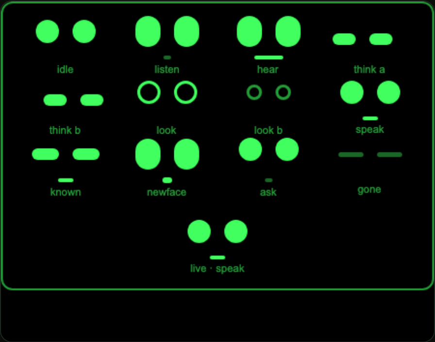

# 18 · The agent face

How Kavi shows what it is doing: three dots, eleven moods, and one rule.

> **The rule.** The face may never claim a state the code is not in. Where a page
> could not tell two situations apart, the fix was to teach the page the
> difference — not to pick a mood that looked plausible.

---

## 0. Why

Before this, Kavi told you what it was doing in prose, and each page invented its
own word for it:

```
   index        thinking          face         working
   connection   working           signin       starting
```

Four enums, one meaning. Meanwhile `pages/face/face.ink` used a single `working`
for two situations that ask **opposite things of the wearer**:

```
   "the shutter is open — hold still"      vs      "waiting on the network — carry on"
```

And the one visual cue that existed had never worked. `pages/index/index.ink`
carried this:

```
   <text class="mark {{ status === 'listening' ? 'on' : '' }}">◉</text>
```

Ink evaluates an interpolation only when it is the **whole** attribute value. So
it looked up a variable literally named `status === 'listening' ? 'on' : ''`,
warned, and drew nothing. The "listening" highlight never once reached a
wearer's display.

---

## 1. Shape, not brightness

A dot here is a `<view>` with a `border-radius` — the recipe `.pill` already
proved on-device. The tempting way to make one expressive is to vary its size and
opacity. That reads as the same two dots at different volumes, and eleven states
will not fit in it.

**Shape** carries far more. The same box, morphing between a circle, a tall oval,
a flat lozenge, a thin bar and a hollow ring, says *alert*, *sleepy*, *shut* and
*looking* without a word of text:

```
   NEUTRAL        ALERT         LOW LID        SQUINT
   24x24 r12      26x32 r13     24x12 r6       28x12 r6

    ▄██▄          ▄██▄                        ▄████▄
    ████          ████                        ▀████▀
    ▀██▀          ████          ▄██▄
                  ▀██▀          ▀██▀

   CLOSED         ASLEEP        APERTURE       LOOKING UP
   26x5  r3       26x5 r3 @40%  18+3px ring    24x24 r12, raised

                                ╭──╮           ▄██▄
   ▀▀▀▀▀▀         ░░░░░░        │  │           ████
                                ╰──╯           ▀██▀
```

So the face is **three boxes**: two eyes that change shape, and one mouth bar
that is hidden for most moods. The eyes do the work.

The mouth earns its place for exactly one reason: `IDLE`, `SPEAK` and `ASK` all
use neutral circles, and without a mouth those three collapse into each other
when nothing is moving.

---

## 2. The eleven moods

```
      IDLE              LISTEN             THINK              LOOK
    resting          mic is open      network in flight   shutter open
                       ▄██▄  ▄██▄
     ▄██▄  ▄██▄        ████  ████                            ╭──╮  ╭──╮
     ████  ████        ████  ████                            │  │  │  │
     ▀██▀  ▀██▀        ▀██▀  ▀██▀       ▄██▄  ▄██▄           ╰──╯  ╰──╯
                          ░░            ▀██▀  ▀██▀

      HEAR              SPEAK              KNOWN             NEWFACE
   you are talking    TTS playing        recognised        who is that?
     ▄██▄  ▄██▄                                              ▄██▄  ▄██▄
     ████  ████       ▄██▄  ▄██▄       ▄████▄▄████▄          ████  ████
     ████  ████       ████  ████       ▀████▀▀████▀          ████  ████
     ▀██▀  ▀██▀       ▀██▀  ▀██▀                             ▀██▀  ▀██▀
     ▀▀▀▀▀▀▀▀▀▀          ▀▀▀▀▀▀            ▀▀▀▀▀▀                ██

       ASK               WARN               GONE
   waiting on you      it failed        signed out

     ▄██▄  ▄██▄
     ████  ████      ▀▀▀▀▀▀  ▀▀▀▀▀▀    ░░░░░░  ░░░░░░
     ▀██▀  ▀██▀
        ░░           ▀▀▀▀▀▀▀▀▀▀▀▀
```

**All eleven differ standing completely still.** That is not a nicety — see §4.

Painted by the real Ink WASM runtime at 448×352, via `pages/probe/probe.ink`:



The cell at the bottom is live — driven by `createFace`, not hardcoded. Four
seconds later it has moved on, which is what motion looks like in a still:


---

## 3. Motion

`animation` and every `@keyframes` property are unsupported, so motion is a
feature-detected recursive `setTimeout` that swaps the bound classes, the same
shape as the sign-in poll. Five moods move; six are genuinely static and start
**no timer at all**, which matters on a battery HUD.

```
  THINK — the pair drifts side to side under lowered lids   (2 frames · 760ms)

     ▄██▄  ▄██▄                     ▄██▄  ▄██▄
     ▀██▀  ▀██▀                     ▀██▀  ▀██▀
     ── frame 1 ──                  ── frame 2 ──

  LOOK — the aperture stops down                            (2 frames · 760ms)

     ╭──╮  ╭──╮                       ╭──╮  ╭──╮
     │  │  │  │                       ╰──╯  ╰──╯
     ╰──╯  ╰──╯

  SPEAK — the mouth opens and closes                        (3 frames · 1.14s)

       ▀▀▀▀▀▀        ▀▀▀▀▀▀▀▀▀▀▀▀          ░░
```

**The dart is the one worth knowing about.** Shifting the pair sideways looks
like it should be `margin-right` on both eyes. It is not — each margin also
lands *between* the eyes, so the pair springs apart instead of moving:

```
   margin-right on BOTH            margin-right on the RIGHT eye only

     ▄██▄        ▄██▄                    ▄██▄  ▄██▄
     ▀██▀        ▀██▀                    ▀██▀  ▀██▀
     (sprung apart — wrong)              (shifted — right)
```

The margin has to sit on the **outer edge of the pair only**, so
`justify-content: center` does the shifting and the gap between the eyes never
changes. Hence three lid tokens: `.ed`, `.edl`, `.edr`.

---

## 4. The degradation ladder

`setTimeout` is not in the verified AIUI API surface. Every timer in this repo is
feature-detected, and the face is no exception:

| host | result |
| --- | --- |
| timers + transitions | eased, breathing face |
| timers, no transitions | discrete flips at ~2.6 fps — still reads as alive |
| **no timers** | **frame 0 of the current mood** |

That last row is why every mood's frame 0 is its most characteristic pose rather
than a neutral midpoint, and why all eleven must be distinct. A frozen face still
has to be a *correct* face.

`SPEAK` is the exception that proves it. `wx.speech.playTTS` is fire-and-forget —
no promise, no `onend` — so its duration is estimated from the text length. With
no timers there would be nothing to *end* SPEAK, so the face **skips it entirely**
and settles straight into the result mood rather than mouthing forever at a
wearer who stopped hearing anything ten minutes ago.

---

## 5. Where each page's state maps

`utils/mood.js` owns the vocabulary. Pages with a status that fully determines the
mood use `moodFor(page, status)`; `index` and `face` set moods imperatively,
because their mood depends on things the status does not carry.

| page | state | mood |
| --- | --- | --- |
| `index` | `idle` / `listening` / `thinking` | IDLE / LISTEN / THINK |
| | `ready` + rows | SPEAK → IDLE |
| | `ready` + unknown person | ASK |
| | `ready` + connections unreachable | GONE |
| | `failed`, nothing cached | WARN |
| | `failed`, agenda still on screen | IDLE (the card is still useful) |
| `face` | `working` — **shutter open** | LOOK |
| | `working` — **service call** | THINK |
| | `naming` | LISTEN → HEAR → THINK |
| | `known` / `saved` | KNOWN |
| | `unknown` | NEWFACE |
| `signin` | `starting` / `waiting` / `approved` | THINK / ASK / KNOWN |
| `connection` | `working` / `not-connected` / `error` | THINK / GONE / WARN |

### The two places the code learned to tell the truth

1. **`face.ink`'s `working` was two states.** `capture()` now sets `LOOK` before
   `takePhoto` and `THINK` before `identify`. "Hold still" and "carry on" are
   different instructions and now look different.
2. **`SpeechRecognition` wired only `onresult`/`onerror`.** `onstart`,
   `onspeechstart` and `onspeechend` are all documented and were unused, so the
   card could not tell *waiting for you* from *you are talking*. Both `index` and
   `face` now wire them — LISTEN → HEAR → THINK.

---

## 6. Rules for changing it

- **Every dot is its own `<view>`, and every `class` is a SINGLE bound token.**
  Whether Ink splits a bound class attribute on whitespace is unverified; if it
  does not, the face renders as nothing at all with no warning.
- **Declare all three keys in `data`** (`...INITIAL`). A key the template binds
  but `data` omits resolves to empty, the `<view>` gets no class, and since
  `display`/`width`/`background-color` all live on the class it becomes an
  invisible zero-size box. This is the most likely way to break the face.
- **Nothing unproven is load-bearing.** Brightness is `background-color` with an
  alpha, not `opacity`. Position is `margin`, not `transform`. `transition` is
  pure enhancement — if the engine drops it the frames become hard cuts, which is
  still correct.
- **Hidden means `rgba(…, 0)`, never `width: 0`** — the box has to keep its space
  or the row reflows and the face jumps sideways whenever the mouth appears.
- **Each `ink:if` gets its own wrapper.** Every conditional sibling in a parent
  joins one chain, and a stray branch beside the face swallows another state.
- **The controller owns the three face keys and writes nothing else**, and no page
  writes them. So the ~2.6 Hz tick can never clobber content, and a content
  update can never clobber the face.
- **No mood may differ from another by position alone.** If margins ever behave
  unexpectedly, every mood must still read by size and shape.

---

## 7. Verifying a change

The CSS is copy-pasted into every page that draws a face (there is no shared
stylesheet, and `@import` inside an `.ink` `<style>` is unverified). Two things
keep that honest, and `npm run pack` refuses to build if either fails:

```
  npm run check:face            # blocks are byte-identical, and every
                               # frame token has a CSS rule
  node dev/check-face.mjs --sync   # propagate from pages/signin/signin.ink
```

For the pixels, use `pages/probe/probe.ink` — a dev-only page showing every pose
at once plus a live cell driven by the real controller. It is not in `app.json`
(a page listed there is dispatchable by the host model) and `dev/pack.mjs`
excludes it from the `.aix`; add the app.json line while you need it.

```
  http://localhost:5178/dev/runtime.html?page=pages/probe/probe&h=352
```

`dev/runtime.html` now takes `?page=`, `?h=352|150|auto` and `?q=` so a given
card is reproducible without clicking. **`dev/preview.html` is not a valid check**
— it is a plain-HTML reimplementation and would happily render a face the real
engine cannot.

### What was confirmed on the real Ink WASM runtime

| | |
| --- | --- |
| single-token bound classes paint | ✅ |
| shape morphs, `border-radius` on small boxes | ✅ |
| `margin-top` placement, and the outer-edge dart | ✅ |
| hollow ring — `border` + `rgba(…, 0)` fill | ✅ |
| hidden dot — `rgba(…, 0)` holds its space | ✅ |
| 40 % green dimming (`GONE` vs `WARN`) | ✅ |
| no "missing from data" warnings on any page | ✅ |
| `setTimeout` / `setInterval` / `clearTimeout` present | ✅ (this build) |
| the tick repaints — 16 frames in 7 s, tokens changing | ✅ |
| 448×352, 448×150 and auto-height all render | ✅ |

**One harness trap worth remembering:** `chrome --headless --virtual-time-budget`
will show you frame 0 forever. Ink's timers live inside its WASM runtime and
Chrome's virtual clock does not advance them, so a screenshot taken that way is
not evidence the animation is broken. Watch it in a real browser, or drive CDP on
the wall clock.

---

## 8. Source map

| file | holds |
| --- | --- |
| `utils/mood.js` | the vocabulary: `MOOD`, `FRAMES`, `createFace`, `moodFor`, `speakMs` |
| `pages/signin/signin.ink` | **the canonical CSS block** (`agentface:begin`/`end`) |
| `pages/index/index.ink` | face in the non-`ready` branch; the dead `.mark` binding removed |
| `pages/face/face.ink` | the LOOK/THINK split; face and person are exclusive |
| `pages/connection/connection.ink` | face until the rows arrive; lifecycle handlers added |
| `pages/probe/probe.ink` | dev-only: every pose, plus a live cell |
| `dev/check-face.mjs` | drift + missing-token check, wired into `npm run pack` |
